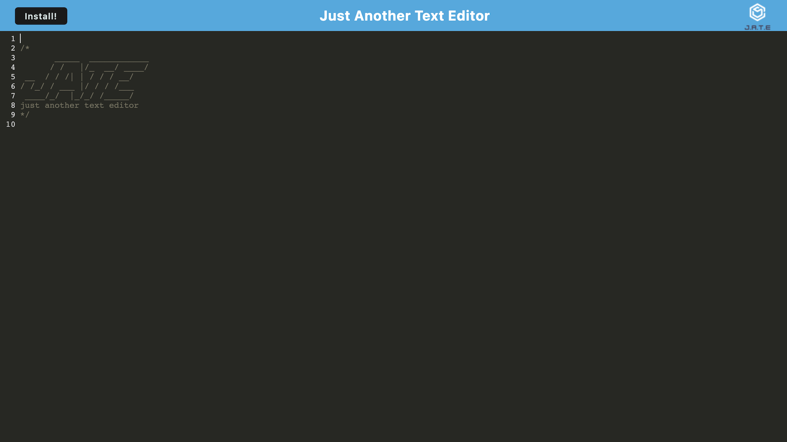

# 19 Progressive Web Applications (PWA): Text Editor

This is a text editor that stores data to a database known as IndexedDB. By saving data to the web browser, it can store more data than localStorage and can operate offline as well as online.

Link to the application here: https://github.com/Dan-To-GitHub/text-editor-hw19.

